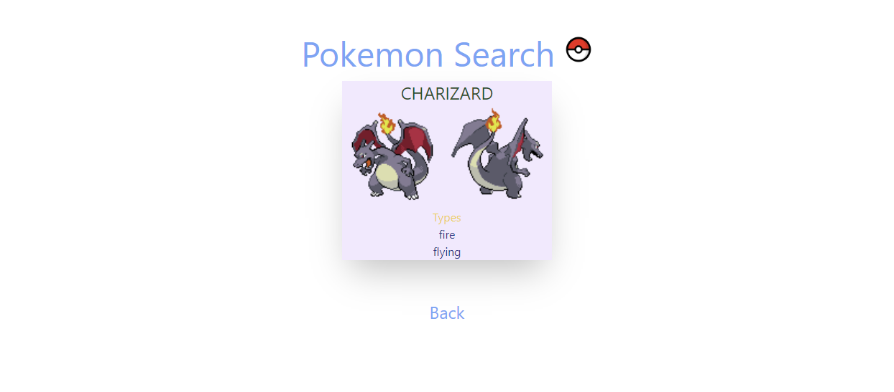

# Vue 3 Pokemon Search

This is a simple Vue 3 project that allows users to search for Pokemon by name using a search bar.

<a href="https://pokemonsearch.herokuapp.com/" target="_blank"><strong>Check out the Web Application »</strong></a>

## Preview

## Usage

1. Enter a Pokemon name in the search bar and hit enter or click the search button.
2. The app will fetch the Pokemon data from the PokeAPI and display the name, image, and types of the Pokemon.
3. If the Pokemon name is invalid, no pokemon names will show below the search bar.
4. If a Pokemon name is valid, click on the pokemon name link to view the pokemon information.
5. Click back link to go back to the home page.

## Features

- Fetches data from the PokeAPI
- Validates user input and displays error messages
- Shows the name, image, and types of the searched Pokemon

## Technologies used

- Vue 3
- PokeAPI
- Composition API

## Credits

- The Pokemon data is provided by the [PokeAPI](https://pokeapi.co/).
- This project took references from the following project (https://www.youtube.com/watch?v=QJhqr7jqxVo)
- This project was created by Leo Hernando Tan(https://github.com/LeoHernando).
